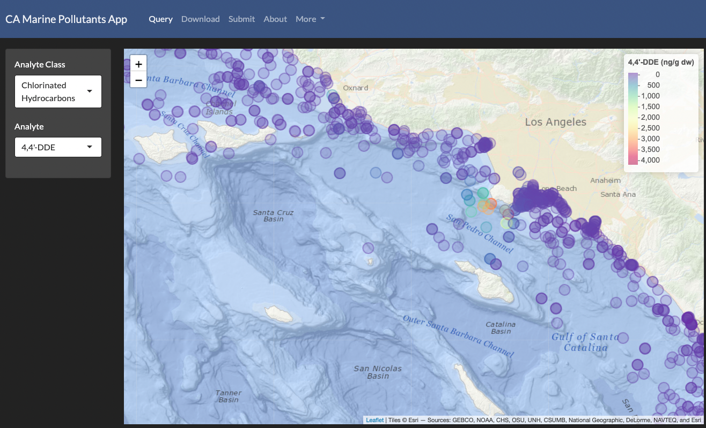

# pollutants-app
Pollutants app (starting with DDT, PFAS, microplastics) with CalCOFI regional partners

## html

These web pages (\*.html) are typically rendered from Rmarkdown (\*.Rmd) or Quarto markdown (\*.qmd) :

<!-- Jekyll rendering: https://marineenergy.github.io/apps/ -->

  
* [{{ file.basename }}]({{ site.baseurl }}{{ file.path }})
  


## source

See https://github.com/CalCOFI/scripts
